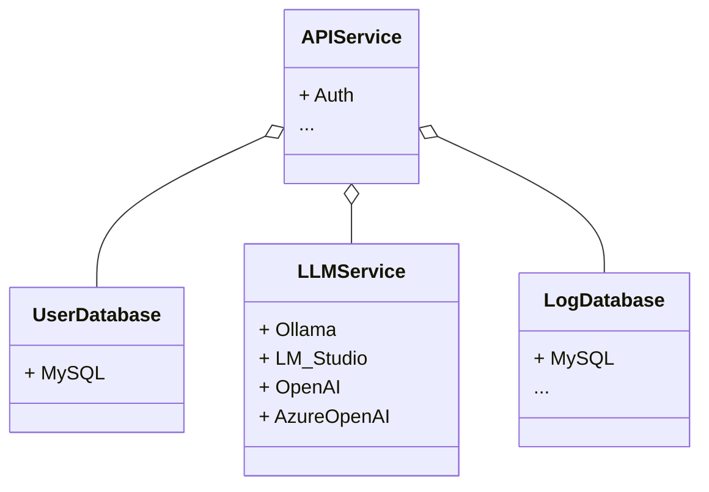

# Architecture

## Classes Schema

### API Service

### Others

## Class Details

| Classes        | File Name          | Details |
| ------------- |:-------------:| :--------:|
| APIService | [apiservice.md](./classes/apiservice.md)  | APIService|
